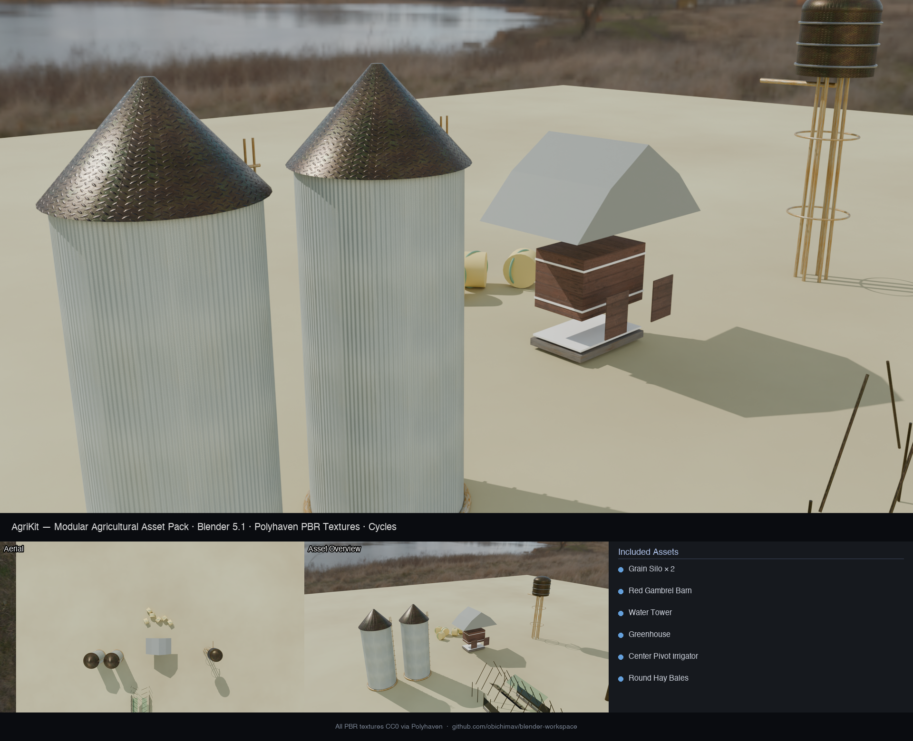

# AgriKit

A Python + Blender modular agricultural asset pack. Six fully procedural farm structures, each textured with free Polyhaven PBR maps, assembled into a single hero scene and rendered from three camera angles with Cycles.



*Grain Silos · Red Barn · Water Tower · Greenhouse · Center Pivot · Hay Bales · Polyhaven PBR Textures · Cycles*

---

## Assets

| Asset | Detail |
|---|---|
| **Grain Silo × 2** | Corrugated iron body, metal-plate cone roof, rusty ladder + rungs, hopper base |
| **Red Gambrel Barn** | Gambrel (two-slope) roof, old wood plank walls with red tint, concrete foundation, barn doors |
| **Water Tower** | Elevated cylindrical tank, domed top, 6 angled support legs, steel banding, outlet pipe |
| **Greenhouse** | Glass panels, metal A-frame ribs + rafters, concrete base strips |
| **Center Pivot Irrigator** | 5-tower arm (28 m span), A-frame towers, horizontal truss, rubber wheels, drop pipes |
| **Round Hay Bales** | 6 bales, cylinder-on-side geometry, plastic wrap band, scattered near barn |

---

## Materials

All materials use full PBR maps from [Polyhaven](https://polyhaven.com) (CC0):

| Polyhaven Slug | Applied To |
|---|---|
| `corrugated_iron` | Silo body, barn roof |
| `old_planks_02` | Barn walls, doors |
| `rusty_metal_02` | Silo hopper, ladder, water tower legs |
| `concrete_wall_005` | Barn foundation, greenhouse base |
| `metal_plate` | Silo roof cap, water tower tank, pivot truss |
| `red_brick_03` | (available, unused) |

Each material loads diffuse + normal (GL) + roughness maps, wired through a UV Mapping node into a `Principled BSDF`.

---

## Project Structure

```
agrikit/
├── src/
│   ├── build_scene.py      # Blender scene: 6 assets + lighting + 3 renders + GLB export
│   └── annotate.py         # PIL showcase composite (hero + aerial + assets + legend)
├── tests/
│   └── test_geometry.py    # 31 pytest tests covering geometry invariants for all 6 assets
├── assets/
│   ├── hdri/               # Polyhaven rural_landscape_2k.hdr
│   └── textures/           # Polyhaven PBR maps (diff + nor_gl + rough, 2K)
├── output/                 # Renders + scene files
├── run_pipeline.sh         # One-command build + annotate
└── README.md
```

---

## Requirements

- Python 3.10+ with `pillow`, `pytest`
- [Blender 5.1](https://www.blender.org/download/)

---

## Setup

```bash
git clone git@github-personal:obichimav/blender-workspace.git
cd blender-workspace/agrikit

python3 -m venv venv
source venv/bin/activate
pip install pillow pytest

# Download Polyhaven assets (free, CC0)
mkdir -p assets/hdri assets/textures

curl -o assets/hdri/rural_landscape_2k.hdr \
  "https://dl.polyhaven.org/file/ph-assets/HDRIs/hdr/2k/rural_landscape_2k.hdr"

for SLUG in corrugated_iron old_planks_02 rusty_metal_02 concrete_wall_005 metal_plate red_brick_03; do
  for MAP in diff nor_gl rough; do
    curl -o "assets/textures/${SLUG}_${MAP}_2k.png" \
      "https://dl.polyhaven.org/file/ph-assets/Textures/png/2k/${SLUG}/${SLUG}_${MAP}_2k.png"
  done
done
```

---

## Usage

```bash
./run_pipeline.sh
```

Or step by step:

```bash
/Applications/Blender.app/Contents/MacOS/Blender \
  --background --python src/build_scene.py -- "$(pwd)"
python src/annotate.py
```

```bash
venv/bin/pytest tests/ -v    # 31 tests
```

---

## Data Sources

| Source | What | Access |
|---|---|---|
| Polyhaven | HDRI + PBR textures (diff/nor_gl/rough) | CC0 free |

---

## Tech Stack

- **Blender 5.1** (`bpy`, `bmesh`) — procedural mesh construction, Cycles PBR rendering, GLB export
- **Polyhaven** — CC0 PBR texture maps wired via `ShaderNodeMapping` → `ShaderNodeTexImage` → `Principled BSDF`
- **Python** `Pillow` — showcase composite with title bar, thumbnails, asset legend

---

## Roadmap

- [ ] Animated center pivot rotation (keyframed around Y axis)
- [ ] Seasonal variants — green summer field vs dry harvest stubble ground
- [ ] Interior barn scene with bale stacks and hay dust particles
- [ ] LOD (Level of Detail) GLB variants for real-time viewers
- [ ] Apply assets to CropSight NDVI field scene

---

## License

MIT
