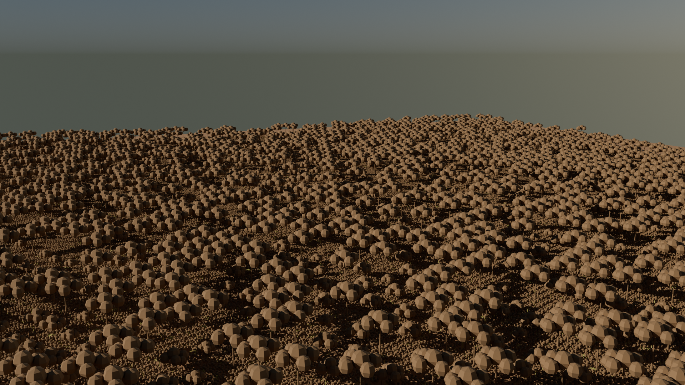

# CacaoSim

A data-driven, photorealistic 3D simulation of a West African cacao agroforestry plantation — built entirely from GIS data and Python, rendered in Blender.



*Hero aerial — Sefwi Wiawso demo plot, Western North Region, Ghana. 69,485 plant instances: cacao, banana, Terminalia superba, Inga edulis, Gliricidia sepium. Rendered in Blender 5.1 Cycles, 128 samples.*

---

## What it does

CacaoSim takes a real farm site (GPS boundary + SRTM elevation data) and produces a fully navigable Blender scene populated with agronomically correct plant spacing and species mix. The pipeline runs end-to-end in Python — no manual placement, no external 3D assets.

```
GeoJSON boundary + DEM
        │
        ▼
   GIS preprocessing           (src/preprocess/)
   • reproject to UTM 30N
   • clip and normalise DEM
   • compute sun position
   • place 69 k+ plants on real terrain
        │
        ▼
   scene_data.json
        │
        ▼
   Blender scene builder        (src/blender/)
   • procedural tree geometry   (bmesh)
   • terrain mesh from heightmap
   • Geometry Nodes instancing
   • Hosek-Wilkie sky + sun lamp
   • 4 cinematic cameras
        │
        ▼
   cacaosim_scene.blend  ──►  F12 → Cycles render
```

---

## Demo site — Sefwi Wiawso, Ghana

| Property | Value |
|---|---|
| Location | 6.2034 N, 2.4912 W — Western North Region |
| Planting model | C_agroforestry (multi-strata shade system) |
| Cacao spacing | 3 m × 3 m rows, slope-aware orientation |
| Shade upper | Terminalia 50 %, Inga 30 %, Gliricidia 20 % @ 12 m |
| Shade middle | Banana @ 6 m |
| Terrain | SRTM 30 m DEM, 1× vertical exaggeration |
| Soil | Laterite (reddish-brown) |
| Sun | March 15, 08:00 local time → 24.6° elevation |

---

## Project structure

```
cacaosim/
├── configs/
│   └── sefwi_demo.json          # site, planting, render config
├── src/
│   ├── preprocess/              # GIS pipeline (Python + GDAL/rasterio)
│   │   ├── run_preprocessing.py # entry point
│   │   ├── gis_loader.py        # boundary + DEM loading
│   │   ├── terrain_analysis.py  # slope, aspect, heightmap export
│   │   ├── plant_placement.py   # agronomic grid + DEM elevation sampling
│   │   ├── sun_calculator.py    # pysolar sun position
│   │   ├── analytics.py         # plant counts, coverage stats
│   │   └── scene_writer.py      # writes scene_data.json
│   └── blender/                 # Blender Python pipeline
│       ├── load_scene.py        # orchestrator (run via run_blender.sh)
│       ├── build_terrain.py     # heightmap PNG → Blender mesh
│       ├── create_assets.py     # procedural trees (bmesh)
│       ├── place_plants.py      # Geometry Nodes instancing
│       ├── setup_lighting.py    # Hosek-Wilkie sky + sun lamp
│       ├── setup_cameras.py     # 4 cinematic cameras
│       └── utils.py             # shared helpers
├── docs/
│   └── hero_aerial.png          # hero render for showcase
├── run.sh                       # Python wrapper (fixes GDAL/PROJ paths)
└── run_blender.sh               # Blender launcher
```

---

## Requirements

### GIS preprocessing
- Python 3.12 (via project venv)
- `rasterio`, `pyproj`, `shapely`, `numpy`, `Pillow`, `pysolar`

### Blender scene + render
- [Blender 5.1](https://www.blender.org/download/) (uses built-in Python — no extra install)

---

## Setup

```bash
git clone git@github.com:obichimav/blender-workspace.git
cd blender-workspace

python -m venv venv
source venv/bin/activate
pip install rasterio pyproj shapely numpy Pillow pysolar
```

> **macOS note:** if you have Conda/mambaforge installed, run all Python commands via `./run.sh` instead of `python` directly — it sets the correct GDAL/PROJ data paths from the venv.

---

## Usage

### Step 1 — GIS preprocessing

```bash
./run.sh src/preprocess/run_preprocessing.py configs/sefwi_demo.json
```

Reads the boundary and DEM, places all plants, writes `data/intermediate/scene_data.json` and `data/intermediate/heightmap.png`.

### Step 2 — Build the Blender scene

```bash
./run_blender.sh
```

Builds the full scene (~69 k plants) and saves `data/outputs/cacaosim_scene.blend`.

Add `--preview 500` for a fast 500-plant test:

```bash
./run_blender.sh --preview 500
```

### Step 3 — Render

Open `data/outputs/cacaosim_scene.blend` in Blender and press **F12** to render the hero aerial camera.

Or render from the command line:

```bash
/Applications/Blender.app/Contents/MacOS/Blender \
  --background data/outputs/cacaosim_scene.blend \
  --python src/blender/render_hero.py
```

---

## Cameras

| Name | Position | Lens | Purpose |
|---|---|---|---|
| `Cam_HeroAerial` | 450 m back, 90 m up | 35 mm | Portfolio hero shot |
| `Cam_EyeLevel` | 290 m back, 1.8 m up | 50 mm | Human-scale perspective |
| `Cam_TopDown` | Directly above at 220 m | 24 mm | Canopy coverage map |
| `Cam_LowAngle` | 350 m out, 4 m up | 50 mm | Dramatic wide angle |

Switch cameras in Blender: **Numpad 0** to enter camera view, then select a different camera and press **Ctrl + Numpad 0** to set it active.

---

## Procedural tree models

All 3D models are generated from scratch in Python using Blender's `bmesh` API — no external `.blend` assets required.

| Species | Height | Key detail |
|---|---|---|
| Cacao (*Theobroma cacao*) | 4 m | Cauliflorous pods on trunk |
| Banana (*Musa* spp.) | 2.5 m | 8-leaf pseudostem |
| Terminalia superba | 15 m | Umbrella canopy |
| Inga edulis | 8 m | Spreading feathery crown |
| Gliricidia sepium | 6 m | Round nitrogen-fixing crown |

---

## Roadmap

- [ ] Real QGIS-digitised farm boundary (replace synthetic test polygon)
- [ ] SRTM DEM download automation
- [ ] Growth stage animation (seedling → juvenile → productive)
- [ ] GLB export for web viewer (Three.js / Babylon.js)
- [ ] Comparison renders: monoculture vs agroforestry canopy
- [ ] Flythrough camera animation

---

## License

MIT
