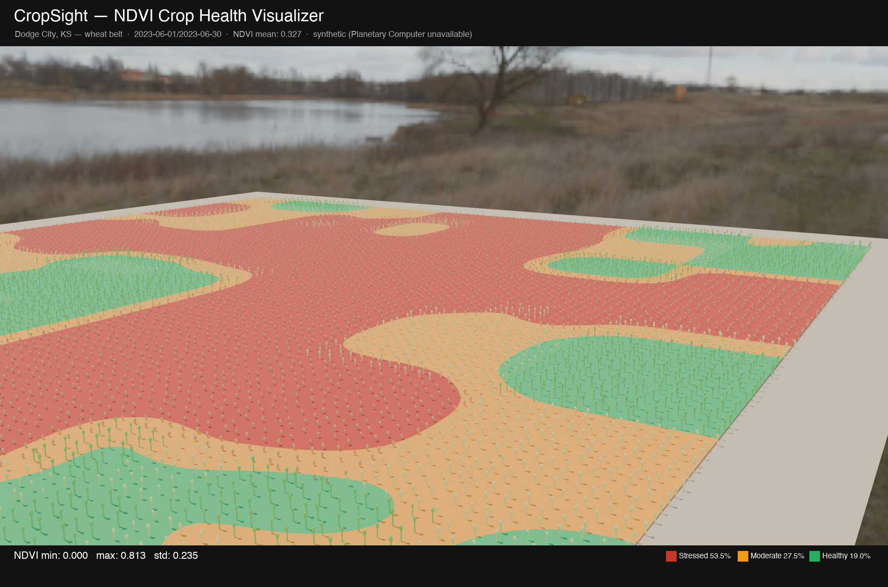

# CropSight

A Python + Blender geospatial pipeline that ingests real Sentinel-2 satellite imagery, computes NDVI crop health indices, and renders a 3D field visualization colour-coded by vegetation stress — combining remote sensing, agricultural data science, and photorealistic 3D rendering.



*Dodge City, KS wheat belt · 200 × 200 m · 10,000 crop instances · NDVI-driven health zones · Polyhaven HDRI*

---

## What It Does

1. **Fetches real satellite data** — searches Microsoft Planetary Computer for the least-cloudy Sentinel-2 L2A scene over the target region; falls back to a procedural synthetic NDVI when offline
2. **Computes NDVI** — `(NIR − Red) / (NIR + Red)` from Sentinel-2 bands B08 and B04
3. **Classifies health zones** — three tiers based on agronomic thresholds:
   - **Stressed** (NDVI < 0.30) — bare soil, drought, disease
   - **Moderate** (0.30 – 0.60) — developing or water-limited crop
   - **Healthy** (NDVI ≥ 0.60) — peak biomass
4. **Generates a DEM heightmap** — procedural rolling terrain (Kansas-style subtle relief)
5. **Renders in Blender** — terrain displaced by DEM, NDVI zone texture, 10,000 procedural wheat stalks height-scaled by health, Polyhaven rural HDRI lighting
6. **Annotates** — adds title, region, date, NDVI statistics, and zone legend via PIL

---

## Zone Colour Key

| Colour | Zone | NDVI range | Meaning |
|---|---|---|---|
| 🔴 Red | Stressed | < 0.30 | Bare soil / drought / disease |
| 🟡 Amber | Moderate | 0.30 – 0.60 | Developing / water-limited |
| 🟢 Green | Healthy | ≥ 0.60 | Peak biomass |

---

## Project Structure

```
cropsight/
├── src/
│   ├── config.py          # Region bbox, dates, NDVI thresholds, paths
│   ├── fetch_data.py      # Sentinel-2 download via Planetary Computer + synthetic fallback
│   ├── compute_ndvi.py    # NDVI computation, zone classification, texture + DEM export
│   ├── run_pipeline.py    # Step 1: Python pipeline (fetch + compute)
│   ├── build_scene.py     # Step 2: Blender 3D scene + render
│   └── annotate.py        # Step 3: PIL annotation overlay
├── tests/
│   └── test_ndvi.py       # 19 pytest tests (classify, metrics, DEM)
├── assets/hdri/           # Polyhaven rural_landscape_2k.hdr (download separately)
├── output/                # Generated files
├── run_pipeline.sh        # One-command full pipeline
└── README.md
```

---

## Requirements

- Python 3.10+ with `numpy`, `matplotlib`, `Pillow`, `scipy`, `rasterio`, `pystac-client`, `planetary-computer`, `shapely`
- [Blender 5.1](https://www.blender.org/download/) (uses its bundled Python)

---

## Setup

```bash
git clone git@github-personal:obichimav/blender-workspace.git
cd blender-workspace/cropsight

python3 -m venv venv
source venv/bin/activate
pip install numpy matplotlib pillow scipy rasterio pystac-client planetary-computer shapely pytest

# Download Polyhaven HDRI (free, CC0)
mkdir -p assets/hdri
curl -o assets/hdri/rural_landscape_2k.hdr \
  "https://dl.polyhaven.org/file/ph-assets/HDRIs/hdr/2k/rural_landscape_2k.hdr"
```

---

## Usage

### Full pipeline

```bash
./run_pipeline.sh
```

### Step by step

```bash
# 1. Fetch satellite data + compute NDVI zones
python src/run_pipeline.py

# 2. Blender 3D scene + render
/Applications/Blender.app/Contents/MacOS/Blender \
  --background --python src/build_scene.py \
  -- "$(pwd)"

# 3. Annotate
python src/annotate.py
```

### Tests

```bash
venv/bin/pytest tests/ -v
```

---

## Changing the Target Region

Edit `src/config.py`:

```python
BBOX_WGS84  = (-100.05, 37.70, -99.95, 37.80)  # lon_min, lat_min, lon_max, lat_max
DATE_RANGE  = "2023-06-01/2023-06-30"
CLOUD_MAX   = 20
NDVI_STRESSED = 0.30
NDVI_HEALTHY  = 0.60
```

---

## Data Sources

| Source | What | Access |
|---|---|---|
| Sentinel-2 L2A | B04 (Red) + B08 (NIR) bands | [Planetary Computer](https://planetarycomputer.microsoft.com/) — free, no API key |
| Copernicus | Satellite programme | ESA open access |
| Polyhaven | HDRI environment | CC0 free |

---

## Tech Stack

- **Python** — `numpy` (NDVI math), `rasterio` (raster I/O), `pystac-client` + `planetary-computer` (satellite data), `scipy` (DEM + upsampling), `matplotlib` + `Pillow` (textures + annotation)
- **Blender 5.1** (`bpy`) — terrain displacement, procedural crop instancing, Cycles CPU render, GLB export
- **Sentinel-2** — 10 m/pixel multispectral satellite imagery (ESA)

---

## Roadmap

- [ ] Real Sentinel-2 raster clip (fix rasterio CRS reprojection for the target UTM zone)
- [ ] Multi-date NDVI time series → animated growing season render
- [ ] Triangulated Irregular Network (TIN) terrain from real SRTM DEM
- [ ] Crop-type classification (wheat vs corn vs fallow) using multi-band composite
- [ ] Integration with SprinkleSim — overlay irrigation coverage on NDVI stress map
- [ ] Variable-rate prescription map export (GeoTIFF output for farm equipment)

---

## License

MIT
