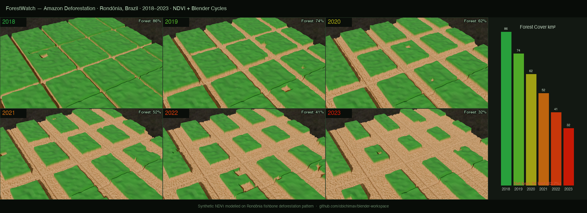
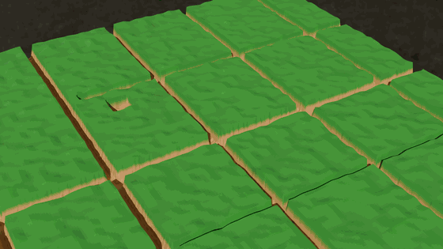

# ForestWatch

A Python + Blender geospatial pipeline that models Amazon deforestation in Rondônia, Brazil across six years (2018–2023), renders the NDVI change as an animated 3D landscape, and exports a showcase composite + animated GIF.



*Rondônia, Brazil · 62.7% forest loss · Fishbone deforestation pattern · NDVI + Blender Cycles*

---

## What It Shows

The iconic **fishbone deforestation pattern** of Rondônia — main highway spines running east-west with north-south branch roads, smallholder farms clearing outward from each road year by year. This pattern is one of the most recognisable deforestation signatures in remote sensing.

| Year | Forest Cover | Change |
|---|---|---|
| 2018 | 85.8 km² (85.8%) | Baseline |
| 2019 | 73.7 km² (73.7%) | −14% |
| 2020 | 62.2 km² (62.2%) | −11% |
| 2021 | 51.5 km² (51.5%) | −17% |
| 2022 | 40.9 km² (40.9%) | −21% |
| 2023 | 32.0 km² (32.0%) | **−62.7% total** |

---

## Animated Time-Lapse



---

## How It Works

1. **Generates a synthetic NDVI time-series** modelled on documented Rondônia deforestation dynamics:
   - Dense forest base (NDVI 0.68–0.90) with spatially-autocorrelated variation
   - Fishbone road network: spine highway + 5 branch corridors
   - Yearly clearing buffer expanding ~2 km/yr from each road
   - Stochastic smallholder farm patches scattering in cleared zones

2. **Builds a 3D Blender scene** for each year:
   - Subdivided terrain plane (256×256 faces)
   - Displace modifier driven by NDVI greyscale heightmap — high-NDVI forest appears raised (canopy illusion), cleared land is flat
   - NDVI RGB colour texture (deep green → tan/brown) swapped per year
   - HDRI + sun lighting, 50mm hero camera

3. **Renders 6 frames** (one per year) + exports GLB for the 2023 state

4. **Composites showcase** — 2×3 render grid, forest-cover bar chart, year/percentage labels, animated GIF

---

## Project Structure

```
forestwatch/
├── src/
│   ├── config.py           # Bbox, years, thresholds, paths
│   ├── generate_data.py    # Synthetic NDVI sequence + stats
│   ├── run_pipeline.py     # Step 1: generate NDVI frames + stats JSON
│   ├── build_scene.py      # Step 2: Blender — 6 renders + GLB export
│   └── annotate.py         # Step 3: showcase composite + animated GIF
├── tests/
│   └── test_deforestation.py  # 37 pytest tests
├── assets/
│   └── hdri/               # Polyhaven rural_landscape_2k.hdr
├── output/                 # Renders + showcase + GIF + .blend + .glb
├── run_pipeline.sh         # One-command full pipeline
└── README.md
```

---

## Requirements

- Python 3.10+ with `numpy`, `pillow`, `scipy`, `pytest`
- [Blender 5.1](https://www.blender.org/download/)

---

## Setup

```bash
git clone git@github-personal:obichimav/blender-workspace.git
cd blender-workspace/forestwatch

python3 -m venv venv
source venv/bin/activate
pip install numpy pillow scipy pytest

# Download Polyhaven HDRI (free, CC0)
mkdir -p assets/hdri
curl -o assets/hdri/rural_landscape_2k.hdr \
  "https://dl.polyhaven.org/file/ph-assets/HDRIs/hdr/2k/rural_landscape_2k.hdr"
```

---

## Usage

```bash
./run_pipeline.sh
```

Or step by step:

```bash
python src/run_pipeline.py   # generate NDVI data

/Applications/Blender.app/Contents/MacOS/Blender \
  --background --python src/build_scene.py -- "$(pwd)"

python src/annotate.py
```

```bash
venv/bin/pytest tests/ -v    # 37 tests
```

---

## The Science

Amazon deforestation follows a well-documented pattern driven by road access. Brazil's BR-364 and state highways created a backbone; branch roads opened lateral corridors; smallholders and ranchers cleared outward from each road. The **fishbone pattern** is detectable in Landsat, Sentinel-2, and MODIS imagery and is a key signal used by INPE's PRODES and Global Forest Watch monitoring systems.

| Concept | This Project |
|---|---|
| NDVI (Normalised Difference Vegetation Index) | Vegetation health proxy from NIR + Red reflectance |
| Fishbone deforestation | Road-corridor clearing pattern in Amazônia Legal |
| Canopy height illusion | NDVI-driven displacement modifier in Blender |
| Deforestation buffer | Euclidean distance transform from road network |

---

## Data Sources

This project uses **synthetic NDVI** modelled on published deforestation dynamics from Rondônia. The pipeline is architected to accept real Sentinel-2 imagery via Microsoft Planetary Computer STAC.

| Source | What |
|---|---|
| Polyhaven | HDRI lighting (CC0 free) |
| INPE PRODES | Deforestation rate reference data |
| Hansen et al. (2013) | Global Forest Change — annual loss basis |

---

## Tech Stack

- **Python** — `numpy` (spatial math), `scipy` (distance transform), `Pillow` (image I/O + GIF)
- **Blender 5.1** (`bpy`) — Displace modifier, texture swapping per frame, Cycles PBR, GLB export
- **Fishbone geometry** — `scipy.ndimage.distance_transform_edt` on road mask

---

## Roadmap

- [ ] Real Sentinel-2 NDVI via Planetary Computer STAC API
- [ ] Smooth camera dolly animation exported as MP4
- [ ] Smoke/haze particle system for active fire season frames
- [ ] Extend to Congo Basin and Borneo deforestation hotspots
- [ ] NDVI anomaly detection — flag statistically significant single-year drops

---

## License

MIT
