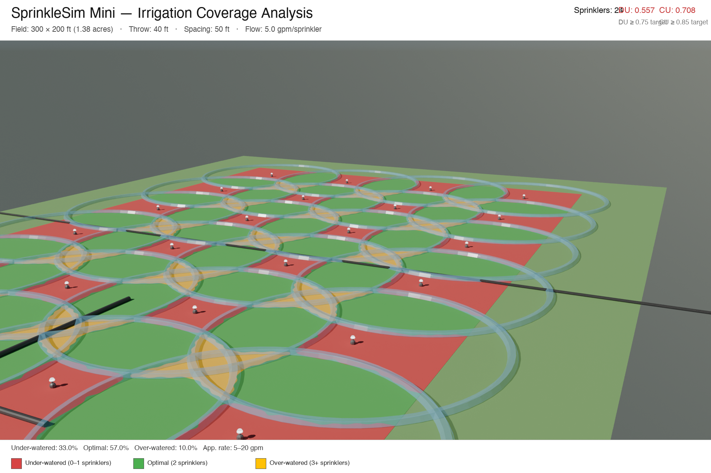

# SprinkleSim Mini

A Python + Blender proof-of-concept that takes a rectangular field and impact sprinkler specs, computes optimal square-grid placement and irrigation coverage uniformity, and produces a top-down technical visualization color-coded by application zone.



*300 × 200 ft field · 24 sprinklers · 40 ft throw · 50 ft spacing · DU 0.557 · CU 0.708*

---

## What It Does

1. **Places sprinklers** in a square grid with edge-buffer handling
2. **Computes coverage** — how many sprinkler circles overlap at every 2 ft cell
3. **Calculates uniformity metrics** used by irrigation engineers:
   - **Distribution Uniformity (DU)** — lower-quartile mean ÷ overall mean (target ≥ 0.75)
   - **Christiansen's CU** — standard deviation-based uniformity (target ≥ 0.85)
4. **Classifies zones** — under-watered, optimal, over-watered
5. **Renders in Blender** — top-down orthographic Cycles render with zone texture
6. **Annotates** — adds title, engineering metrics, and legend via PIL

The demo result (DU 0.557, CU 0.708) intentionally falls below target — the visualization shows exactly *where* the field is under-served, which is the point.

---

## The Visualization

| Color | Zone | Sprinkler count |
|---|---|---|
| 🔴 Red | Under-watered | 0–1 sprinklers |
| 🟢 Green | Optimal | 2 sprinklers |
| 🟡 Yellow | Over-watered | 3+ sprinklers |

---

## Project Structure

```
sprinklesim/
├── src/
│   ├── config.py            # Field size, sprinkler specs, paths
│   ├── coverage_engine.py   # Core math (placement, DU, CU, zones)
│   ├── run_pipeline.py      # Step 1: compute + write data.json + zone texture
│   ├── sanity_check.py      # matplotlib sanity visualization
│   ├── build_scene.py       # Step 2: Blender headless scene + render
│   └── annotate.py          # Step 3: PIL annotation overlay
├── output/                  # Generated files (gitignored except showcase + .blend)
├── run_pipeline.sh          # One-command full pipeline
└── README.md
```

---

## Requirements

- Python 3.10+ with `numpy`, `matplotlib`, `Pillow`
- [Blender 5.1](https://www.blender.org/download/) (uses its bundled Python)

---

## Setup

```bash
git clone git@github.com:obichimav/blender-workspace.git
cd blender-workspace/sprinklesim

python3 -m venv venv
source venv/bin/activate
pip install numpy matplotlib pillow
```

---

## Usage

### Full pipeline (one command)

```bash
./run_pipeline.sh
```

This runs all three steps and writes `output/sprinklesim_coverage_demo.png`.

### Step by step

```bash
# 1. Compute coverage math → output/data.json + output/zone_texture.png
python src/run_pipeline.py

# 2. Sanity check (matplotlib) → output/sanity_check.png
python src/sanity_check.py

# 3. Blender scene + render → output/raw_render.png
/Applications/Blender.app/Contents/MacOS/Blender \
  --background \
  --python src/build_scene.py \
  -- "$(pwd)"

# 4. Annotate → output/sprinklesim_coverage_demo.png
python src/annotate.py
```

---

## Changing Parameters

Edit `src/config.py`:

```python
FIELD_WIDTH_FT    = 300      # field width
FIELD_HEIGHT_FT   = 200      # field height
SPRINKLER_THROW_FT = 40      # sprinkler throw radius
OVERLAP_FACTOR    = 0.625    # 0.5–0.65 typical; increase to tighten spacing
```

Re-run `./run_pipeline.sh` to regenerate everything.

---

## Engineering Context

Real irrigation design targets **DU ≥ 0.75** and **CU ≥ 0.85**. The demo uses a 50 ft square spacing with a 40 ft throw — edge cells only receive coverage from one sprinkler, pulling the lower-quartile down. To reach target uniformity, you'd either:
- Reduce spacing to ~45 ft (`OVERLAP_FACTOR = 0.5625`)
- Increase the throw radius
- Add a perimeter row at half-spacing

---

## Tech Stack

- **Python** — `numpy` (coverage math), `matplotlib` (zone texture + sanity check), `Pillow` (annotation overlay)
- **Blender 5.1** (`bpy`) — orthographic Cycles render, UV-mapped zone texture, cylinder sprinkler markers
- **JSON** — data interchange between the Python math layer and Blender

---

## Roadmap

- [ ] Adjust spacing interactively and show DU/CU change in real time
- [ ] Triangular layout pattern (better uniformity than square)
- [ ] Multiple sprinkler types / zones
- [ ] Real GIS field boundary (shapefile → Blender mesh)
- [ ] 3D infrastructure: pipes, risers, pump
- [ ] Water arc particle animation
- [ ] Hydraulic engine (pressure loss, pipe sizing)

---

## License

MIT
