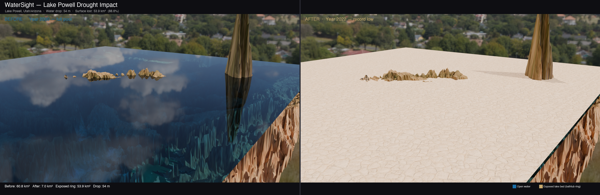

# WaterSight

A Python + Blender geospatial pipeline that downloads **real terrain elevation** and **satellite imagery** tiles for Lake Powell, Utah/Arizona, computes water extent change between 2000 and 2022, and renders a **before/after 3D drought visualisation** driven entirely by real geospatial data.



*Lake Powell · 54 m water drop · 88.6% surface area lost · Real AWS terrain tiles + ESRI satellite imagery*

---

## What It Does

1. **Downloads real terrain tiles** — AWS Terrain Tiles (Terrarium RGB elevation encoding, free, no auth)  
2. **Downloads satellite imagery** — ESRI World Imagery tiles stitched into a single texture  
3. **Classifies water zones** by comparing real elevations against historical water levels:
   - Zone 0 — currently submerged (below 2022 low)
   - Zone 1 — **the bathtub ring** (exposed between 2000 full pool and 2022 low)
   - Zone 2 — upland canyon terrain (always above water)
4. **Renders two Blender states** on the same real terrain mesh:
   - **Before (2000)** — water plane at 1,128 m ASL, Cycles Fresnel water material
   - **After (2022)** — water plane at 1,074 m ASL, Polyhaven cracked mud texture on exposed bed
5. **Annotates** — side-by-side comparison with water loss statistics

---

## The Numbers

| Metric | Value |
|---|---|
| Water level (2000) | 1,128 m ASL — full pool |
| Water level (2022) | 1,074 m ASL — record low |
| Drop | **54 m** |
| Surface area lost | **~54 km² (88.6%)** |
| Terrain resolution | 1,536 × 1,536 px (~15 m/px at zoom 11) |

---

## Project Structure

```
watersight/
├── src/
│   ├── config.py           # Bbox, water levels, paths
│   ├── fetch_terrain.py    # Download + stitch elevation + satellite tiles
│   ├── compute_zones.py    # Water extent classification + area stats
│   ├── run_pipeline.py     # Step 1: Python pipeline
│   ├── build_scene.py      # Step 2: Blender scene + dual render
│   └── annotate.py         # Step 3: PIL side-by-side composite
├── tests/
│   └── test_hydro.py       # 20 pytest tests (tiles, decode, zones, stats)
├── assets/
│   ├── hdri/               # Polyhaven kloofendal semi-arid HDRI
│   └── textures/           # Polyhaven rock + cracked mud PBR textures
├── output/                 # Generated renders + scene files
├── run_pipeline.sh         # One-command full pipeline
└── README.md
```

---

## Requirements

- Python 3.10+ with `numpy`, `matplotlib`, `pillow`, `scipy`, `requests`
- [Blender 5.1](https://www.blender.org/download/)

---

## Setup

```bash
git clone git@github-personal:obichimav/blender-workspace.git
cd blender-workspace/watersight

python3 -m venv venv
source venv/bin/activate
pip install numpy matplotlib pillow scipy requests pytest

# Download Polyhaven assets (free, CC0)
mkdir -p assets/hdri assets/textures

curl -o assets/hdri/kloofendal_48d_partly_cloudy_2k.hdr \
  "https://dl.polyhaven.org/file/ph-assets/HDRIs/hdr/2k/kloofendal_48d_partly_cloudy_2k.hdr"

curl -o assets/textures/rock_ground_02_diff_2k.png \
  "https://dl.polyhaven.org/file/ph-assets/Textures/png/2k/rock_ground_02/rock_ground_02_diff_2k.png"
curl -o assets/textures/rock_ground_02_rough_2k.png \
  "https://dl.polyhaven.org/file/ph-assets/Textures/png/2k/rock_ground_02/rock_ground_02_rough_2k.png"
curl -o assets/textures/mud_cracked_dry_03_diff_2k.png \
  "https://dl.polyhaven.org/file/ph-assets/Textures/png/2k/mud_cracked_dry_03/mud_cracked_dry_03_diff_2k.png"
```

---

## Usage

```bash
./run_pipeline.sh
```

Or step by step:

```bash
python src/run_pipeline.py   # fetch tiles + compute zones
/Applications/Blender.app/Contents/MacOS/Blender \
  --background --python src/build_scene.py -- "$(pwd)"
python src/annotate.py
```

```bash
venv/bin/pytest tests/ -v    # run 20 tests
```

---

## Data Sources

| Source | What | Access |
|---|---|---|
| AWS Terrain Tiles | Terrarium RGB elevation | Free, no auth |
| ESRI World Imagery | Satellite texture tiles | Free for portfolio use |
| Polyhaven | HDRI + PBR textures | CC0 free |

---

## Tech Stack

- **Python** — `requests` (tile download), `numpy` (elevation decode/zone math), `Pillow` (stitching + annotation)
- **Blender 5.1** (`bpy`) — real DEM displacement, Cycles water material (Fresnel/refraction/glossy), PBR cracked earth, dual-state render, GLB export
- **AWS Terrain Tiles** — Mapzen/AWS terrarium elevation format, zoom 11
- **ESRI World Imagery** — satellite base map tiles

---

## Roadmap

- [ ] Time-series animation — render frames for every year 2000–2022
- [ ] NDWI from Sentinel-2 for precise water boundary detection
- [ ] Volume shader water (light scattering with depth colour shift)
- [ ] Apply to other drought-hit water bodies: Aral Sea, Lake Chad, Poopó Bolivia
- [ ] Flood variant: 2022 Pakistan floods, Hurricane Harvey inundation

---

## License

MIT
